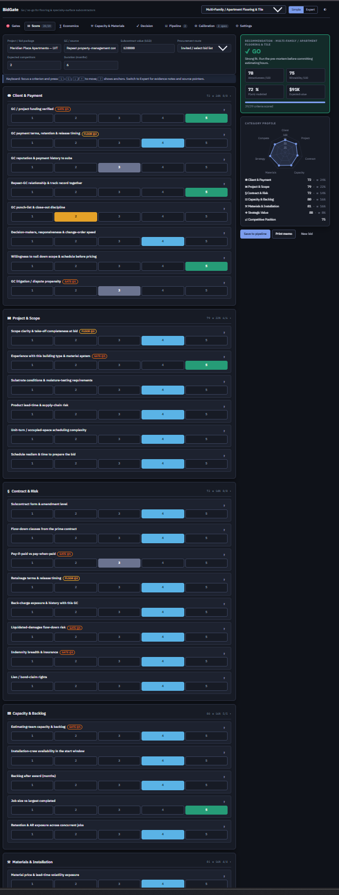

# BidGate

**Go / no-go bid qualification for flooring, tile & specialty-surface subcontractors.**

> Live demo → [nathan-taylor-ops.github.io/bidgate](https://nathan-taylor-ops.github.io/bidgate/) · Single file → [`dist/bidgate.html`](dist/bidgate.html) (download, open, works offline)

   



---

## The problem

A flooring, tile or specialty-surface subcontractor lives or dies on which packages it chooses to bid to general contractors. Most bid/no-bid decisions are a gut call in a Monday meeting; the ones that use a spreadsheet use a weighted sum of 1–5 scores — which lets a great margin "pay for" a GC who cannot pay, hides all uncertainty behind one number, and is never checked against what actually happened.

Nothing on the market fixes this. Procore, Buildertrend, JobTread and the rest distribute bids; they do not qualify them. The two AEC CRMs with a real go/no-go module (Unanet, Deltek) are "build it yourself" forms behind enterprise pricing. Nobody ships outcome calibration. Nobody models the position of a specialty-trade subcontractor bidding to a GC, as distinct from a general contractor's own prime-contract risk.

## What BidGate does differently

| | Typical scorecard | BidGate |
|---|---|---|
| Deal-killers | a low score, averaged away | **gates evaluated first** — non-compensatory, verdict is NO-GO (gated) whatever the total |
| Criteria | 8–15 vague labels | **42 criteria with behavioural anchors** at 1 / 3 / 5, sourced to the literature |
| One number | yes | **two axes** — attractiveness (want it?) and winnability (can win it?) — plotted as a 2×2 |
| Weights | typed in | direct, **swing weighting**, or **AHP** with a consistency ratio |
| Uncertainty | none | **tornado**, switching values in words, weight-robustness %, **beta-PERT Monte Carlo** on margin, value and P(win) |
| P(win) | a guess | route base rate with **empirical-Bayes shrinkage** toward your own record, competitor scaling, position shift, **Friedman & Gates** price curves |
| Cash | ignored | **peak negative cash** for the job and **retention/AR exposure overlap** across your live jobs vs cash + credit line |
| Subcontractor position | ignored | **pay-if-paid vs pay-when-paid, flow-down clauses, retainage release timing, Miller Act / mechanics-lien rights** scored as their own gated criteria, not a general contractor's own contract risk |
| Materials & installation | ignored | **installer certification, material price/lead-time volatility, moisture-testing/QC documentation, callback exposure by failure mode** (moisture delamination, grout/tile cracking, turf seam failure) |
| After the decision | nothing | **calibration loop** — Brier score, reliability diagram, hit rate by count and value, which criteria separate wins from losses, human override rate |
| Output | a number | **one-page printable decision memo** with gates, anchors met, economics, pre-mortem and signatures |
| Markets | one | presets for **Multi-Family / Apartment Flooring & Tile**, **Commercial TI Flooring & Tile**, **Specialty Surfaces (Athletic / Turf)** — US-only, no regulatory-preset machinery |

Everything runs in the browser. Nothing is sent anywhere. Bids persist in localStorage; export/import as JSON; share one bid via a URL fragment.

## Try it in 90 seconds

1. Open the live demo. Three synthetic sample bids load — a GO, a gated NO-GO, and a CONDITIONAL.
2. On **Score**, focus a criterion and press `1`–`5`. Press `?` for the anchors. Watch the verdict panel.
3. Set **GC / project funding verified** to 1. The verdict gates regardless of everything else. That is the point.
4. Open **Decision** for the tornado and "what would flip this". Open **Economics** for P(win), EV and the Monte Carlo. Open **Capacity & Materials** for cash exposure, estimating/crew load and a read-out of the Materials & Installation scores.
5. **Print memo** — one page for the bid committee.
6. Later, on **Pipeline**, record won / lost and the actual margin. **Calibration** tells you whether the tool is any good.

## Methodology

Full write-up with sources: [docs/METHODOLOGY.md](docs/METHODOLOGY.md). In one paragraph:

Gates are conjunctive screening (Gilbride & Allenby 2004). Group weights default to the pooled evidence in a 24-study meta-analysis of bid/no-bid factors (payment terms, client solvency and payment history rank highest — applied one contract tier down, to GC payment behaviour toward subs) and are configurable by swing weighting or AHP (Saaty). Win probability shrinks a route base rate toward your own record (Beta-Binomial, α = 10), scales by 1/(n+1) for competitors, shifts on the logit scale for competitive position, and shows Friedman/Gates curves for hard bids. Monte Carlo uses beta-PERT three-point inputs. Peak cash uses a first-principles S-curve approximation and a lightweight retention/AR-exposure overlap across concurrent jobs (Elazouni 2009). Subcontractor-specific contract risk (pay-if-paid vs pay-when-paid, Miller Act / mechanics-lien rights, flow-down and retainage) replaces prime-contract risk. Calibration reports Brier score with Murphy decomposition on 5 bins. Every threshold is a labelled, dated default — not a standard.

## Architecture

```
index.html                 shell + CSS; loads src/ui/app.js as an ES module (no build step)
src/data/criteria.js       42 criteria, anchors, gates, contexts, evidence pointers
src/data/presets.js        3 presets: weights, locale, economics, capacity gates (dated)
src/data/dealkillers.js    manual deal-killers per preset; mitigation library
src/engine/scoring.js      gates → compensatory score (two axes) → floor; sensitivity; robustness
src/engine/weights.js      swing weighting; AHP with consistency ratio and worst-cell finder
src/engine/pwin.js         base-rate shrinkage, competitor & position adjustment, Friedman/Gates
src/engine/ev.js           expected value, levies (unused in current US-only presets), bid cost, break-even, pursuit ratio
src/engine/capacity.js     peak cash, portfolio retention/AR overlap, capacity gates
src/engine/montecarlo.js   beta-PERT, seeded RNG, quantiles, histogram
src/engine/calibration.js  Brier, Murphy, reliability bins, hit rates, criterion separation
src/ui/*.js                views (score, gates, economics, capacity & materials, decision, pipeline, calibration, settings), charts, state, memo
samples/samples.js         three synthetic bids
tests/engine.test.js       43 tests, node:test, zero dependencies
scripts/build-single.mjs   emits dist/bidgate.html — every module inlined via an import map
scripts/smoke.mjs          headless Chromium: every view, keyboard scoring, print memo, mobile
docs/METHODOLOGY.md        sources and formulas
docs/adr/                  architecture decision records
```

The engine is pure functions with no DOM, so it is unit-tested directly. The UI is plain DOM + Chart.js from cdnjs — no framework, no bundler, no npm install.

```bash
git clone https://github.com/nathan-taylor-ops/bidgate.git
cd bidgate
node --test            # 43 tests
node scripts/build-single.mjs # dist/bidgate.html
python3 -m http.server 8080   # then open http://localhost:8080  (ES modules need http://, not file://)
```

## Design decisions

Recorded as ADRs in [`docs/adr/`](docs/adr/). The short versions:

- **Gates before scores.** A compensatory model cannot represent "no". ([ADR-0002](docs/adr/0002-gates-precede-score.md))
- **Two axes, not one.** Attractiveness and winnability are different questions with different owners. ([ADR-0003](docs/adr/0003-two-axes.md))
- **Swing/AHP over direct weights.** Direct weighting is the method the UK Analysis Function says not to use. ([ADR-0004](docs/adr/0004-swing-and-ahp.md))
- **Beta-PERT, not triangular.** Softer tails, mass near the mode. ([ADR-0005](docs/adr/0005-beta-pert.md))
- **No regression until 60 outcomes.** Below that, show separation and let people reason. ([ADR-0006](docs/adr/0006-no-model-before-60.md))
- **Single file, no build.** The user is an estimating manager, not a developer; it has to open from a USB stick. ([ADR-0001](docs/adr/0001-single-file-no-build.md))
- **Local-first.** Bid data is commercially sensitive. localStorage and URL fragments only. ([ADR-0007](docs/adr/0007-local-first.md))
- **Okabe-Ito RAG, dual-encoded.** 1 in 12 men cannot rely on red/green; every state carries an icon and a word. ([ADR-0008](docs/adr/0008-okabe-ito.md))
- **Radio buttons, not sliders.** Sliders raise break-off 6.9× and degrade ordinal data (Funke, Reips & Thomas 2011) (the swing-weighting tool uses a range input for weights only, where the value is continuous and no ordinal data is collected).

## Roadmap

- [ ] Blind multi-rater mode with per-criterion disagreement bands
- [ ] Logistic fit unlocked at ≥ 60 decided outcomes, coefficients shown beside your weights
- [ ] Optional bring-your-own-key AI pre-scoring: paste a tender, get proposed scores with quoted evidence — *drafts, cites, never decides*; gates are never AI-set
- [ ] Portfolio selector: enumerate pursue/skip combinations for ≤ 8 open pursuits under worst-case cash and staffing
- [ ] Per-GC retention-release history learned from your own pipeline

## Why I built this

I was a Project Manager at a commercial builder doing flooring and tile delivery — bidding multi-family, apartment and commercial building packages worth US$100K–$4M per discipline as a specialty subcontractor to general contractors. Alongside project management I ran and audited the three-person commercial estimating team. One recurring job type was artificial-turf installation for a school athletic facility, which is why specialty/athletic surfaces get their own preset here.

I built a bid-qualification calculator there that scored relationship strength, historical win record and expected revenue, alongside payment terms and the GC's ability to pay, scope clarity, whether we'd delivered that building type before, how full the estimating queue already was, deal size and margin, and how many other bidders we were up against. Scored by hand, updated in a Monday meeting. It cut rework 30%, lifted average margin 8%, and moved us from bidding one major job every two weeks to two-to-four a week (small bids from two-to-four days down to hours-to-a-day) — and from losing most bids to winning the majority of the qualified ones. This is what that spreadsheet should have been: the same questions, with a gate that stops a good total from hiding a disqualifying answer, the uncertainty shown instead of hidden, and every assumption written down and sourced.

I use AI the same way at work: I own the domain model, the assumptions and what ships; the AI does research synthesis and code. Built with Claude as a pair on this one, research synthesis across roughly 150 sources, engine design and test scaffolding. Every formula, threshold and weight has a source or is labelled as a judgement call. All sample data is synthetic; no employer data, prices or projects appear anywhere in this repository.

## Licence

MIT. Use it, fork it, put your own weights in. Attribution appreciated, not required.

## About

Built by Nathan Taylor — operations and estimating background in construction, now building tools for the problems that background surfaced. [nathan.taylor.ops@gmail.com](mailto:nathan.taylor.ops@gmail.com)
