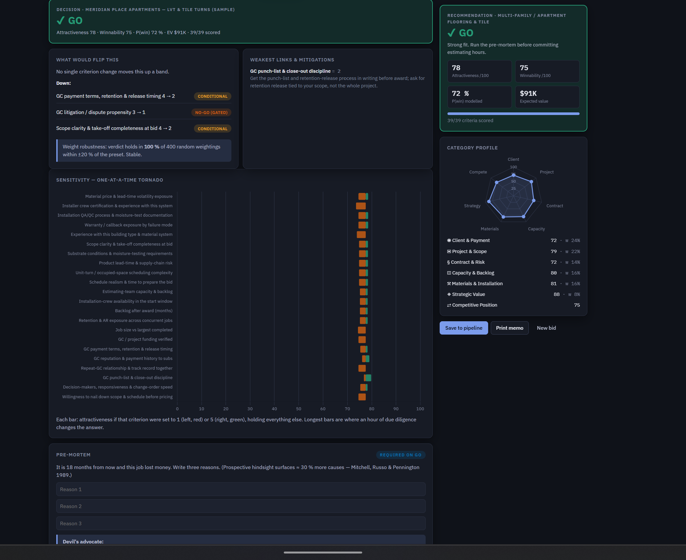
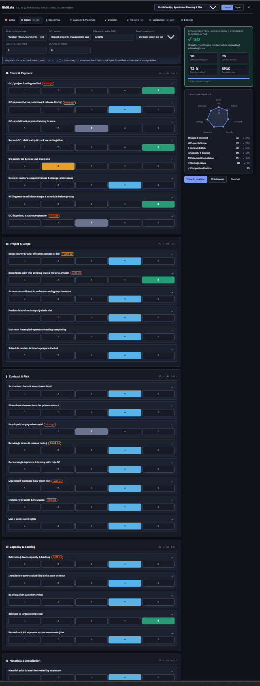

# BidGate

**Commercial bid governance and pursuit decision support for specialty contractors.**

BidGate helps answer a management question that sits upstream of estimating:

> **Should we commit scarce estimating, working-capital and delivery capacity to this opportunity — and what would change the answer?**

It combines hard commercial gates, bid attractiveness, probability of win, margin and expected value, cash exposure, delivery capacity, uncertainty and an auditable approval record. It is a portfolio project built from operating experience, not a claim of production deployment.

**[Open the live demo](https://NathanTaylorOps.github.io/bidgate/)** · **[Read the management case study](docs/CASE_STUDY.md)** · **[View the one-page decision memo](assets/memo.pdf)** · [Methodology](docs/METHODOLOGY.md)

[](https://github.com/NathanTaylorOps/bidgate/actions/workflows/ci.yml) [](LICENSE)



> The [management case study](docs/CASE_STUDY.md) connects the operating problem, decision logic, implementation approach and results behind the project.

## Why this exists

A bid is not just an estimating task. Pursuing it consumes **management attention, estimating capacity, working capital and future delivery capacity** before the business knows whether it will win the work.

In practice, those decisions are often spread across experience, spreadsheets and meetings. A single weighted score can also hide the reason a job should not be pursued: an attractive margin should not compensate for unverified funding, unacceptable contract terms or a business that cannot resource the work.

BidGate turns that judgement into a visible decision process:

```text
OPPORTUNITY
    │
    ▼
HARD GATES ─────────────── fail ──────────────► NO-GO / EXCEPTION
    │ pass                                        │
    ▼                                             │ authorised override
ATTRACTIVENESS + WINNABILITY                      │
    │                                             │
    ▼                                             │
ECONOMICS ── margin · P(win) · pursuit cost · EV  │
    │                                             │
    ▼                                             │
CASH + CAPACITY ── funding · backlog · resources  │
    │                                             │
    ▼                                             │
UNCERTAINTY ── sensitivity · switching · ranges   │
    │                                             │
    ▼                                             │
MANAGEMENT DECISION ◄─────────────────────────────┘
    │
    ▼
OUTCOME ── won / lost / withdrawn · actual margin
    │
    ▼
CALIBRATION ── compare forecast with reality
    │
    └────────────────────────► improve assumptions and thresholds
```

The system does not make the management decision. It makes the assumptions, constraints and reasons behind that decision easier to inspect, challenge and record.

### From judgement in the room to a repeatable operating process

| Typical pursuit process | Governed pursuit process |
|---|---|
| Opportunities enter the estimating queue with inconsistent screening. | Opportunities are screened before scarce estimating effort is committed. |
| Commercial risks can be buried inside an overall impression or score. | Non-negotiable gates are separated from compensating factors. |
| Revenue and headline margin dominate the conversation. | Return is considered alongside win probability, pursuit cost, cash and capacity. |
| Capacity is checked after the business is already invested in the pursuit. | Estimating, delivery and working-capital constraints are visible before commitment. |
| Assumptions live across spreadsheets, inboxes and meetings. | Material assumptions and evidence sit with the decision record. |
| Senior approval can be informal or unclear. | Routine, conditional, exceptional and override decisions have explicit ownership. |
| Won/lost outcomes are discussed but rarely recalibrate the process. | Forecasts are frozen, outcomes recorded and judgement reviewed against reality. |

## What this project demonstrates

For me, the value of this project is not the web application itself. It demonstrates how I approach an operating problem:

- **Commercial discipline** — qualify revenue rather than treating all pipeline value as equally desirable.
- **Risk governance** — separate true deal-breakers from risks that can be traded against return.
- **Resource allocation** — consider estimating workload, delivery capacity and working-capital exposure before committing.
- **Decision rights** — distinguish GO, management approval, conditional and NO-GO states and preserve the reason for an override.
- **Decision-making under uncertainty** — show sensitivity and ranges instead of presenting a fragile point estimate as certainty.
- **Continuous improvement** — record outcomes and compare predictions with what actually happened.
- **System design** — turn tacit operating knowledge into a repeatable process without hiding judgement behind a black box.

## Operating origin and results

The project is an expanded portfolio version of a much simpler bid-qualification process I developed while working as a Project Manager and estimating lead for a commercial flooring and tile contractor. I was involved in packages of roughly **US$100K–US$4M per discipline** and ran/audited a three-person commercial estimating team.

The operating process used practical qualification factors including client relationship, historical win record, payment risk, scope clarity, relevant experience, estimating workload, deal size, margin and competitive intensity. In that environment, the broader estimating improvements delivered:

| Operating result | Outcome |
|---|---:|
| Estimating rework | **30% reduction** |
| Average margin | **8% improvement** |
| Major-bid throughput | **from roughly one every two weeks to 2–4 per week** |
| Small-bid turnaround | **from 2–4 days to hours–1 day** |
| Qualified bids | **majority won** |

Those results belong to the operating process and team in which the original calculator was used; they are **not claims that this portfolio application itself produced those results**.

BidGate asks what that original process should look like if the decision logic were made explicit, tested, auditable and capable of learning from outcomes.

## The management decision

A useful pursuit review needs to answer more than “is this a good job?”

| Management question | BidGate response |
|---|---|
| Is there a reason we should not pursue this at all? | Hard gates are evaluated before the score. |
| Do we actually want the work? | Commercial attractiveness is assessed separately from ability to win. |
| Can we win it? | Competitive position and probability of win remain visible rather than being buried in one score. |
| Is the return worth the pursuit effort? | Margin, bid cost, expected value and break-even conditions are shown. |
| Can the business fund and deliver it? | Working-capital exposure, live-job overlap and estimating/crew capacity are checked. |
| How fragile is the recommendation? | Sensitivity, switching values and Monte Carlo ranges show what could change the answer. |
| Who decided, and why? | Approval conditions, overrides and decision records preserve accountability. |
| Are our judgements improving? | Won/lost outcomes and actual margin feed a calibration view. |

## A 90-second review

For a quick review of the project:

1. **Open the [live demo](https://NathanTaylorOps.github.io/bidgate/).** Six synthetic bids show different decision states.
2. On **Score**, change **GC / project funding verified** to 1. A hard commercial failure gates the opportunity regardless of the total score.
3. Open **Decision** to see the major decision drivers, weakest links and what would change the verdict.
4. Open **Economics** and **Capacity & Materials** to see whether an attractive opportunity also makes sense for cash and delivery.
5. Open **Pipeline** and **Calibration** to see how the decision record closes the loop after the outcome is known.
6. Review the **[one-page decision memo](assets/memo.pdf)** for the management output rather than the software interface.



## Governance principles

BidGate is intentionally designed as **decision support, not automated authority**.

- **Gates before scores.** A disqualifying commercial condition cannot be averaged away by attractive features elsewhere.
- **Incomplete means incomplete.** The system does not manufacture confidence from partially scored gates.
- **Human overrides remain possible.** The reason is recorded so management judgement is visible rather than silently replacing the model.
- **Predictions freeze before outcomes.** Once a bid is decided, the original forecast is preserved so later calibration cannot benefit from hindsight.
- **Defaults are assumptions, not standards.** Thresholds and weights are labelled and intended to be replaced with company evidence.
- **Sensitive data stays local in this version.** The application uses browser storage and explicit export/share mechanisms rather than a hosted bid database.
- **No black-box model before there is enough evidence.** The project deliberately avoids fitting a predictive model to a tiny outcome history.

The detailed rationale is recorded in the [methodology](docs/METHODOLOGY.md) and [architecture decision records](docs/adr/).

## How the model works

BidGate evaluates an opportunity in three layers.

**1. Non-negotiable gates.** Funding, contract, capacity and other must-pass conditions are checked first. A failed gate can produce a NO-GO even when the opportunity otherwise looks attractive.

**2. Structured judgement.** Forty-two behaviourally anchored criteria are grouped around client/payment, project/scope, materials/installation, capacity/backlog, contract/risk, strategic value and competitive position. Attractiveness and winnability remain separate so “we want it” is not confused with “we can win it.”

**3. Economics and uncertainty.** The system estimates probability of win, expected value, working-capital exposure and portfolio overlap, then shows sensitivity and uncertainty around the recommendation.

The implementation includes swing weighting and AHP, empirical-Bayes updating, beta-PERT Monte Carlo analysis and outcome calibration. Those methods are deliberately kept out of the executive decision language; their assumptions, formulas and sources are documented in [METHODOLOGY.md](docs/METHODOLOGY.md).

## What a real implementation would require

This repository is a portfolio reference implementation. I would not put it into a live commercial environment unchanged.

A production deployment would require company-specific authority limits and thresholds, authenticated users and role-based access, controlled persistent storage, audit logging, integration with CRM/estimating/ERP data, jurisdiction-specific legal review, configuration management, backup/recovery, security review, user acceptance testing and calibration against the company's own historical outcomes.

The adoption process matters as much as the software: establish the existing decision baseline, agree decision rights, configure thresholds, run the system in parallel, train users, review exceptions and false signals, then progressively integrate it into the operating cadence.

See the **[Management Case Study](docs/CASE_STUDY.md)**, **[Implementation & Governance](docs/IMPLEMENTATION.md)** and **[Limitations](docs/LIMITATIONS.md)**.

## Validation and quality controls

The decision engine is separated from the interface and tested as business logic. The current suite covers the scoring, gate, economics, capacity, uncertainty and calibration paths. CI runs the tests, rebuilds the standalone release, verifies that the committed build matches source and performs browser smoke tests before deployment.

That matters because a decision-support system should fail visibly when its rules are broken rather than quietly changing management outcomes after a code change.

```bash
git clone https://github.com/NathanTaylorOps/bidgate.git
cd bidgate
node --test
node scripts/build-single.mjs
python3 -m http.server 8080
```

### Repository structure

```text
src/data/                 criteria, presets and deal-killers
src/engine/               scoring, weights, P(win), EV, capacity, Monte Carlo and calibration
src/ui/                   interface, charts, state and decision views
samples/                  synthetic demonstration bids
tests/                    business-rule tests
scripts/                  standalone build and browser smoke test
docs/METHODOLOGY.md       assumptions, formulas, evidence and sources
docs/adr/                 key design decisions
dist/bidgate.html         portable single-file build
```

## Key design decisions

The ADRs preserve the reasoning behind important choices rather than just the final implementation.

- **Gates before scores** — a compensatory score cannot represent a genuine “no”.
- **Two axes, not one** — attractiveness and winnability answer different management questions.
- **Swing/AHP weighting** — makes trade-offs more explicit than arbitrary percentage allocation.
- **No predictive fit until sufficient outcomes exist** — avoid false sophistication from a small sample.
- **Local-first portfolio build** — bid information is commercially sensitive.
- **Accessible decision states** — status is carried by words/icons as well as colour.
- **Portable release** — the standalone version can run without a hosted application stack.

## Scope and limitations

BidGate currently models the perspective of a **US flooring, tile and specialty-surface subcontractor bidding to general contractors**. It is not a universal construction procurement model, legal advice, a production ERP/CRM, or an autonomous bidding system.

The sample bids are synthetic. No employer, client or confidential project data are included in this repository.

Known modelling and implementation limits are documented rather than hidden: [docs/LIMITATIONS.md](docs/LIMITATIONS.md).

## Further development

Potential next steps include blind multi-rater scoring, portfolio optimisation across simultaneous pursuits, company-specific retention history and—only after enough decided outcomes exist—an interpretable fitted model alongside management-set weights.

An AI-assisted tender review could also propose scores from cited tender evidence, but it should remain draft support: **AI should not clear a hard gate or make the pursuit decision.**

## Related operations projects

BidGate is one part of a portfolio built around operating questions rather than software tutorials:

- **[Job Cost Risk Dashboard](https://github.com/NathanTaylorOps/job-cost-risk-dashboard)** — which active project needs intervention, and why?
- **[Resource Scheduling & Tracking](https://github.com/NathanTaylorOps/resource-scheduling-tracking-system)** — are the people, equipment, permits and compliance ready for tomorrow's work?
- **[Scenario Sensitivity Engine](https://github.com/NathanTaylorOps/scenario-sensitivity-engine)** — does an investment still make sense when the assumptions move?
- **[Days of Cover](https://github.com/NathanTaylorOps/DaysofCover)** — where does the supply network fail first, and which mitigation buys the most resilience?

Together they reflect the same operating approach: **make the constraint visible, expose the assumptions, assign the decision, test the result and improve the system.**

## About

Built by **Nathan Taylor**, an operations leader with experience across construction, manufacturing, defence and asset-heavy environments. My focus is using commercial discipline, operating systems, data and technology to make decisions easier to see, explain and act on.

**[View the full operations portfolio](https://github.com/NathanTaylorOps)**

## Licence

MIT.
